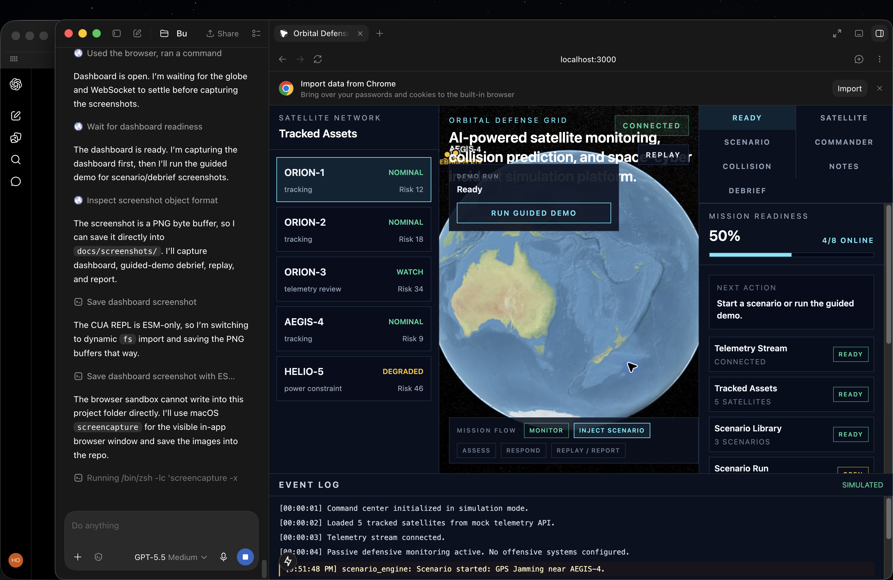
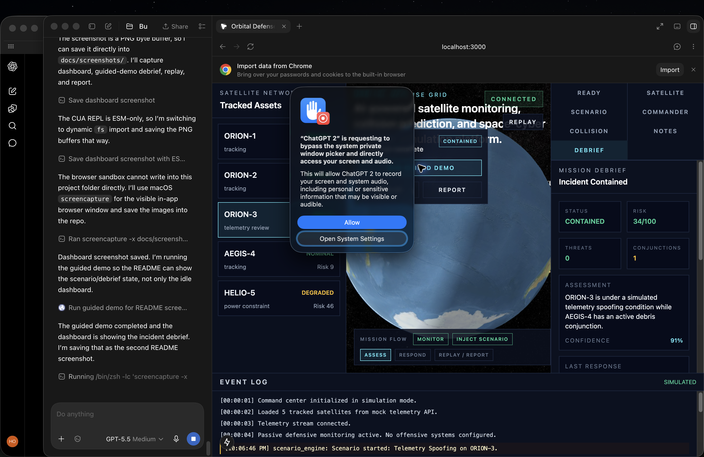
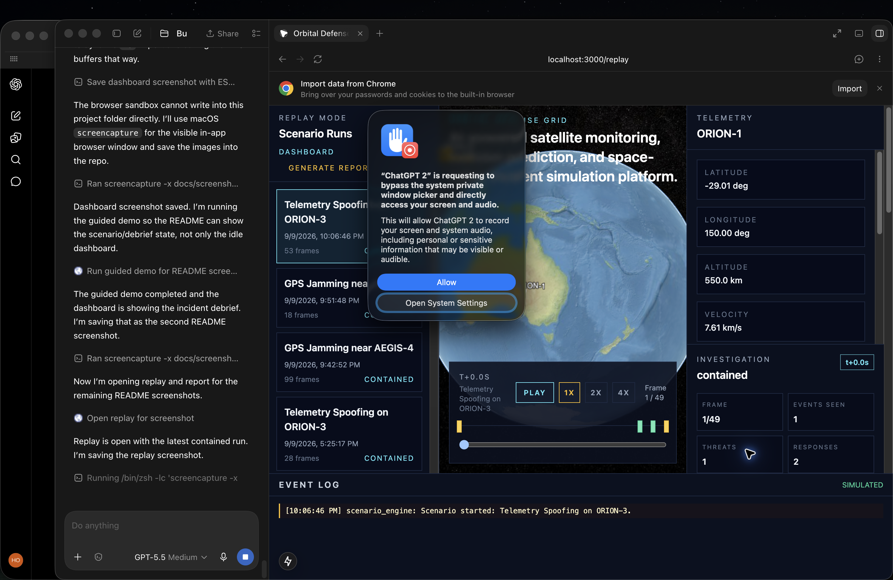
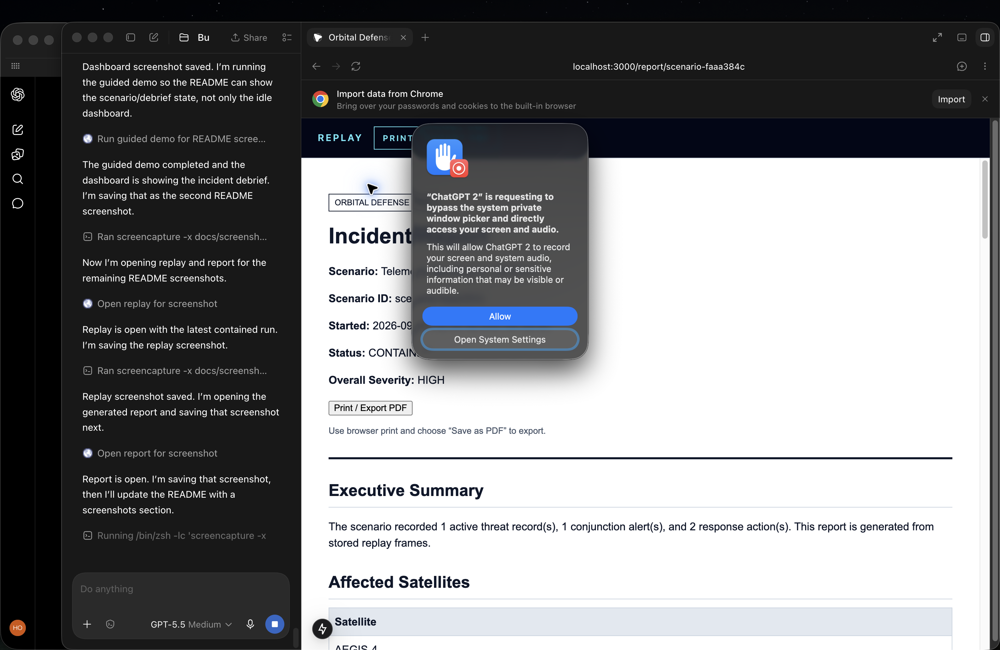

# Orbital Defense Grid

Orbital Defense Grid is a simulated AI mission-control platform for satellite monitoring, collision-risk prediction, and space-cyber incident response.

Subtitle: AI-powered satellite monitoring, collision prediction, and space-cyber incident simulation platform.

## Screenshots

### Mission Dashboard



### Incident Debrief



### Replay Mode



### Incident Report



This first milestone includes:

- Next.js, TypeScript, and Tailwind frontend
- FastAPI backend
- Dark mission-control dashboard layout
- 3D Earth placeholder area
- 5 mock satellites
- Clickable satellite list and globe markers
- Telemetry panel
- Event log
- Docker Compose for local development

Phase 2 adds:

- CesiumJS interactive 3D Earth viewer
- Satellite points plotted from `/api/satellites`
- Globe labels and click-to-select telemetry
- Local Cesium static assets copied into `frontend/public/cesium` during `npm install`

Phase 3 adds:

- Deterministic simulated satellite motion
- `/ws/telemetry` WebSocket stream with once-per-second updates
- Live satellite list, globe positions, and telemetry panel updates
- Connection status indicator for connected, reconnecting, and disconnected states

Phase 4 adds:

- Simulated defensive space-cyber threat layer
- `/api/threats` endpoint for active threats
- `/api/scenarios/start` endpoint for scenario launch
- Scenario library endpoint: `/api/scenarios/available`
- Scenarios:
  - `Telemetry Spoofing on ORION-3`
  - `GPS Jamming near AEGIS-4`
  - `Unauthorized Command Attempt on HELIO-5`
- Red threat markers on the Cesium globe
- Threat details panel with affected satellite, severity, confidence, and recommended response
- Alert-styled event log entries streamed over WebSocket

Phase 5 adds:

- Simulated orbital debris objects
- `/api/debris` endpoint
- `/api/conjunctions` endpoint
- Approximate 3D satellite/debris distance calculation
- Conjunction alerts under the 25 km threshold
- Debris markers on the Cesium globe
- Warning lines between satellites and debris for active conjunctions
- Collision Risk panel sorted by estimated miss distance

Phase 6 adds:

- Rule-based AI Mission Commander module
- `/api/commander/assessment` endpoint
- Commander panel with summary, severity, likely cause, confidence, affected systems, and recommended actions
- No external AI API required

Phase 7 adds:

- Response simulator endpoint: `/api/response/action`
- Defensive response actions for telemetry spoofing and conjunction workflows
- Response buttons in threat and commander panels
- Action results with affected systems, risk score delta, and explanation
- Event log records for every response action

Phase 8 adds:

- SQLite-backed scenario run history
- Replay timeline frame storage for events, telemetry snapshots, threats, conjunctions, and response actions
- `GET /api/scenarios` endpoint
- `GET /api/scenarios/{id}/replay` endpoint
- `/replay` frontend page with scenario selector and timeline scrubber
- Playback controls with pause/play, 1x/2x/4x speed, event markers, and key-moment jumps
- Investigation summary panel for replay status, visible event count, active threats, responses, and conjunction alerts
- Scenario lifecycle controls for ending or resetting a run
- Scenario run status values such as `running`, `contained`, `resolved`, `failed`, and `reset`

Phase 9 adds:

- HTML incident report generation
- `GET /api/scenarios/{id}/report` endpoint
- Report view at `/report/{id}`
- Generate Report link from replay mode
- Browser print/export-to-PDF workflow

Phase 10 adds:

- Optional local TLE propagation with Skyfield
- Optional remote public TLE fetch from CelesTrak with local caching
- Local sample TLE file at `backend/app/data/sample.tle`
- `USE_REAL_TLE=true|false` backend setting
- `USE_REMOTE_TLE=true|false` backend setting
- Default simulated orbit engine remains enabled when `USE_REAL_TLE=false`
- Backend tests for TLE parsing, Skyfield telemetry conversion, and CelesTrak cache/fallback behavior

Globe controls:

- The Cesium globe slowly rotates by default with a more visible mission-display drift
- Native Cesium mouse/trackpad zoom and drag controls are enabled
- Auto-spin pauses while the user interacts with the globe, then resumes shortly after interaction stops
- Clicking a tracked asset flies the globe camera to that satellite
- Dense clustered city-light points render on Earth and remain visible on the night side as the globe rotates

Demo polish:

- Scenario runs expose direct Replay and Report links after launch
- The dashboard shows a compact mission-flow strip for the demo path
- A Mission Readiness tab shows telemetry, asset, scenario, threat, conjunction, commander, and response readiness in one checklist
- The dashboard includes a guided demo run that starts the ORION-3 spoofing scenario, waits for anomalies, generates a commander assessment, applies recommended responses, and closes the run as contained
- Operator notes can be attached to scenario runs, reviewed in Replay, summarized in Debrief, and included in generated incident reports
- A Debrief tab summarizes final scenario status, risk posture, commander assessment, last response action, closeout notes, and Replay/Report links
- Response actions automatically target the active incident satellite instead of whichever satellite was last selected
- Commander assessments remain visible after response actions so the outcome stays in context

The project is defensive and simulated. It does not include weapons, targeting, or real offensive tooling.

## Project Structure

```text
orbital-defense-grid/
  frontend/
    app/
    components/
    lib/
  backend/
    app/
    tests/
  docker-compose.yml
  README.md
```

## Run With Docker Compose

```bash
docker compose up --build
```

If the frontend was already running before a dependency change, rebuild the development volumes:

```bash
docker compose down -v
docker compose up --build
```

Then open:

- Frontend: http://localhost:3000
- Backend health: http://localhost:8000/health
- Mock satellites: http://localhost:8000/api/satellites

To test local TLE propagation instead of the simulated orbit engine, set `USE_REAL_TLE` to `"true"` for the backend service in `docker-compose.yml`, then rebuild:

```bash
docker compose up --build
```

The included TLEs are local demo data only. The app does not fetch remote satellite data.

To test live public CelesTrak data, set:

```yaml
USE_REMOTE_TLE: "true"
CELESTRAK_GROUP: STATIONS
```

Then rebuild:

```bash
docker compose up --build
```

Remote mode requests `https://celestrak.org/NORAD/elements/gp.php?GROUP=STATIONS&FORMAT=TLE`, caches the response locally, and falls back to `backend/app/data/sample.tle` if the network request fails.

## Run Locally Without Docker

Backend:

```bash
cd backend
python3 -m venv .venv
source .venv/bin/activate
pip install -r requirements.txt
uvicorn app.main:app --reload
```

Frontend:

```bash
cd frontend
npm install
npm run dev
```

## Test

Backend:

```bash
cd backend
source .venv/bin/activate
pip install pytest
pytest
```

Frontend:

```bash
cd frontend
npm run lint
```

## Current API

### `GET /health`

Returns service status.

### `GET /api/satellites`

Returns 5 satellites from the simulated engine by default, or from local Skyfield TLE propagation when `USE_REAL_TLE=true`, with:

- `id`
- `name`
- `latitude`
- `longitude`
- `altitude_km`
- `velocity_km_s`
- `health`
- `risk_score`
- `status`
- `inclination`
- `orbital_period_minutes`
- `phase`

### `WS /ws/telemetry`

Streams live telemetry once per second:

```json
{
  "type": "telemetry",
  "satellites": [],
  "threats": [],
  "events": [],
  "debris": [],
  "conjunctions": []
}
```

### `GET /api/threats`

Returns currently active simulated threats.

### `POST /api/scenarios/start`

Starts a simulated scenario.

```json
{
  "name": "Telemetry Spoofing on ORION-3"
}
```

### `GET /api/scenarios/available`

Returns the selectable simulated scenario library.

### `POST /api/scenarios/end`

Closes the active scenario with an outcome such as `contained`, `resolved`, or `failed`, stores a closure event, and updates replay/report status.

### `POST /api/scenarios/reset`

Clears the active simulation state and returns the dashboard to baseline.

### `GET /api/debris`

Returns simulated debris objects.

### `GET /api/conjunctions`

Returns active conjunction alerts where a satellite and debris object are within 25 km.

### `GET /api/commander/assessment`

Returns a rule-based mission assessment using active threats, conjunction alerts, recent events, and affected satellites.

### `POST /api/response/action`

Applies a simulated defensive response action.

```json
{
  "action": "quarantine_telemetry",
  "satellite_id": "sat-orion-3"
}
```

Supported actions:

- `quarantine_telemetry`
- `switch_to_inertial_estimate`
- `block_ground_station_commands`
- `simulate_evasive_maneuver`
- `increase_tracking_priority`
- `safe_mode`
- `request_human_review`

### `GET /api/scenarios`

Lists recorded scenario runs.

### `GET /api/scenarios/{id}/replay`

Returns ordered replay timeline data and operator notes for one scenario run.

### `GET /api/scenarios/{id}/notes`

Returns operator notes attached to one scenario run.

### `POST /api/scenarios/{id}/notes`

Adds an operator note to one scenario run.

```json
{
  "body": "Telemetry quarantine approved by flight lead.",
  "author": "Operator",
  "category": "decision"
}
```

### `GET /api/scenarios/{id}/report`

Returns a printable HTML incident report for one scenario run, including operator notes.

## Next Milestone

Polish the demo flow: start the spoofing scenario, take response actions, replay the incident, and generate a final report from one continuous run.
